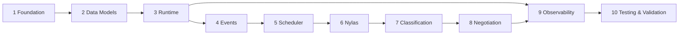

# Implementation Plan — Pluvus Workflow Prototype

> A practical, execution-ordered roadmap to validate the architecture in
> [`system-architecture.md`](./system-architecture.md). Each phase is independently
> demonstrable. Build the engine before the email and AI integrations so the state
> machine can be validated with fakes first, then made real.

**Sequencing principle:** prove the *core loop* (engine → events → scheduler) on stubs
before introducing external dependencies (Nylas, LangGraph). External integrations are
adapters behind interfaces, so they slot in without reworking the engine.

---

## Phase 1 — Repository Foundation

**Objective:** Stand up the monorepo, tooling, and local infrastructure so every later phase has a place to land.

**Deliverables:**
- Workspace layout: `web/` (React/Vite), `server/` (Express/TS), `agent/` (Python/LangGraph).
- `docker-compose` for PostgreSQL + Redis.
- Shared TypeScript config, lint/format, env handling, run scripts.
- Health-check endpoint and a "hello" UI that hits it.

**Dependencies:** none.

**Acceptance Criteria:** `docker compose up` brings up Postgres + Redis; web, server, and agent all start; UI reaches the server health endpoint; agent service responds to a ping.

---

## Phase 2 — Data Models

**Objective:** Implement the persistence layer for definitions vs. execution.

**Deliverables:**
- Prisma schema for `Workflow`, `WorkflowVersion`, `Creator`, `ExecutionInstance`, `Message`, `Event` (per architecture §6).
- Migrations + a seed script with a **mocked** creator list and the in-scope linear workflow definition.
- Repository/service helpers for CRUD.

**Dependencies:** Phase 1.

**Acceptance Criteria:** Migrations apply cleanly; seed creates a workflow, one published version, and N mocked creators; instances can be created pinned to a version; `Event` and `Message` tables write and read back.

---

## Phase 3 — Workflow Runtime

**Objective:** Build the engine that advances an execution instance through the linear node path with correct completion/stop semantics — validated with **stubbed** email/AI.

**Deliverables:**
- Node executor interface (input contract → run → output contract → transition).
- The creator state machine (architecture §10) with explicit transition guards.
- Implementations for `Import → Initial Outreach → Follow-Up → Reply Detection → Negotiation → End` using fakes for send/classify/negotiate.
- Synchronous "advance instance" path callable from a test harness.

**Dependencies:** Phase 2.

**Acceptance Criteria:** Given a seeded instance, the engine walks it end-to-end with stubs; illegal transitions are rejected; follow-up and negotiation loops respect their counters and terminate; every transition appends an `Event`.

---

## Phase 4 — Event System

**Objective:** Make advancement event-driven through queues rather than direct calls.

**Deliverables:**
- BullMQ queues `node-execution` and `inbound-email` (architecture §7).
- Idempotent worker handlers wrapping the Phase 3 executors; per-instance ordering for state-mutating jobs.
- Append-only event logging at the queue boundary; retry/backoff config.

**Dependencies:** Phase 3.

**Acceptance Criteria:** Enqueuing a `node-execution` job advances the instance via a worker; handlers are safe to re-run (re-delivery causes no double transition); a simulated `inbound-email` job drives the reply path; events are logged for each job.

---

## Phase 5 — Scheduler

**Objective:** Drive time-based follow-ups and cancel them on reply.

**Deliverables:**
- BullMQ delayed jobs for follow-up timers, keyed by instance.
- Scheduling on entry to `AWAITING_REPLY`; cancellation by job id when a reply arrives.
- Max-follow-up enforcement → `NO_RESPONSE`.

**Dependencies:** Phase 4.

**Acceptance Criteria:** A due follow-up fires a `node-execution` job and increments the counter; an injected reply cancels the pending follow-up; reaching max follow-ups transitions to `NO_RESPONSE`. Verifiable on compressed (seconds-scale) intervals.

---

## Phase 6 — Nylas Integration Layer

**Objective:** Replace the email stub with real Nylas send + inbound ingestion.

**Deliverables:**
- Nylas adapter behind the existing send interface (outbound) — persists message/thread ids on `Message`.
- `/webhooks/nylas` handler: signature verification, correlation by thread id, fast ack, enqueue `inbound-email`.
- Config/secrets for a sandbox Nylas account.

**Dependencies:** Phase 5 (engine + queues + scheduler already real).

**Acceptance Criteria:** Outreach sends a real email via Nylas; a manual reply hits the webhook, is persisted, correlated to the right instance, and enqueued; the engine advances off the real inbound event. Webhook acks well within Nylas's timeout.

---

## Phase 7 — Reply Classification

**Objective:** Turn raw inbound replies into intents that drive transitions.

**Deliverables:**
- `classify` operation in the LangGraph service (`positive` / `negative` / `question` / `opt-out` + confidence).
- Worker integration: `inbound-email` job calls `classify`, then transitions (positive/question → `NEGOTIATING`; negative → `REJECTED`; opt-out → `OPTED_OUT`).
- Low-confidence / fallback handling (e.g., route to a manual-review state or default-safe transition).

**Dependencies:** Phase 6 (real inbound events) + agent service from Phase 1.

**Acceptance Criteria:** Sample replies classify to the correct intent and produce the correct transition; opt-out short-circuits to terminal; low-confidence path is exercised and does not mis-advance.

---

## Phase 8 — Negotiation Agent

**Objective:** Run the bounded negotiation loop via LangGraph.

**Deliverables:**
- `draft` and `negotiate` graphs in the agent service (negotiate applies stop rules: max rounds, term floor/ceiling).
- Worker negotiation loop: each inbound reply in `NEGOTIATING` calls `negotiate` → `accept` / `counter` / `reject`; counters send a new email and increment the round; `ACCEPTED`/`REJECTED` terminate.
- Outreach/follow-up copy generated via `draft`.

**Dependencies:** Phase 7.

**Acceptance Criteria:** A multi-turn negotiation reaches `ACCEPTED` or `REJECTED`; max rounds forces termination; the loop never runs unbounded; drafted outreach/follow-up copy is sent through Nylas.

---

## Phase 9 — Observability

**Objective:** Make execution legible — for debugging and to demonstrate the "where is each creator" outcome.

**Deliverables:**
- React Flow pipeline UI showing per-node creator counts (in progress / waiting / failed) via TanStack Query.
- Instance detail / inspector: state, message thread, event timeline.
- Structured logging across API/workers/agent; an event-timeline endpoint.

**Dependencies:** Phases 3–8 (real state to display).

**Acceptance Criteria:** The canvas reflects live counts as instances move; clicking a node lists waiting instances; an instance's full event/message history is viewable; logs trace a transition end-to-end.

---

## Phase 10 — Testing & Validation

**Objective:** Prove all ten success criteria and confirm the architecture is promotion-ready.

**Deliverables:**
- Unit tests for state-machine transitions and stop rules.
- Integration tests for queue handlers and idempotency (re-delivery).
- End-to-end scenario tests on mocked data: happy path, no-response, opt-out, multi-round negotiation.
- Versioning test: edit workflow → new version → in-flight instances stay pinned.
- A validation report mapped to [`source-of-truth.md` §8](./source-of-truth.md).

**Dependencies:** Phases 1–9.

**Acceptance Criteria:** All scenario tests pass; idempotency and follow-up cancellation are covered; versioning pinning is proven; the report explicitly confirms each of the ten success criteria.

---

## Phase Dependency Map

**Validation-first note:** Phases 3–5 prove the engine on stubs. Phases 6–8 swap stubs
for real Nylas/LangGraph behind stable interfaces. If a phase invalidates an assumption,
revisit [`open-questions.md`](./open-questions.md) before continuing.
