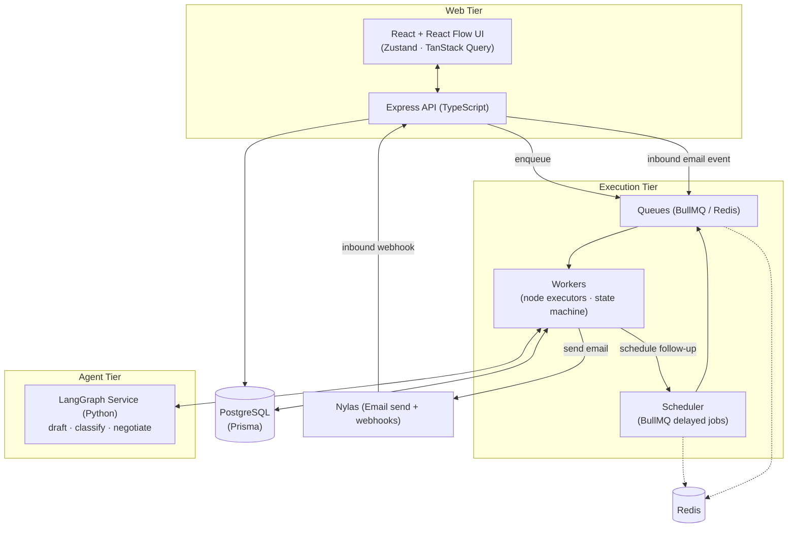
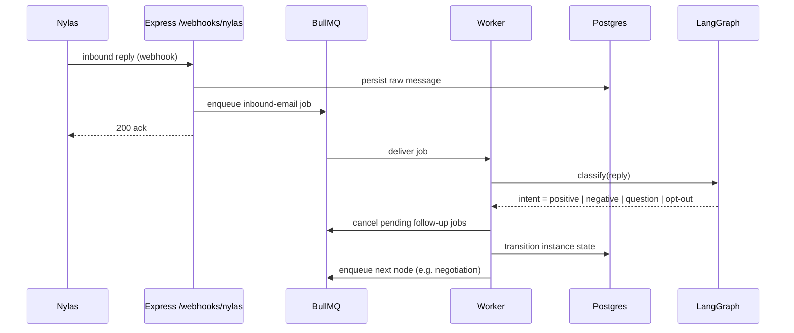
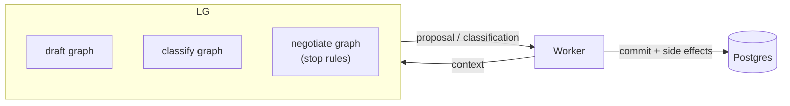
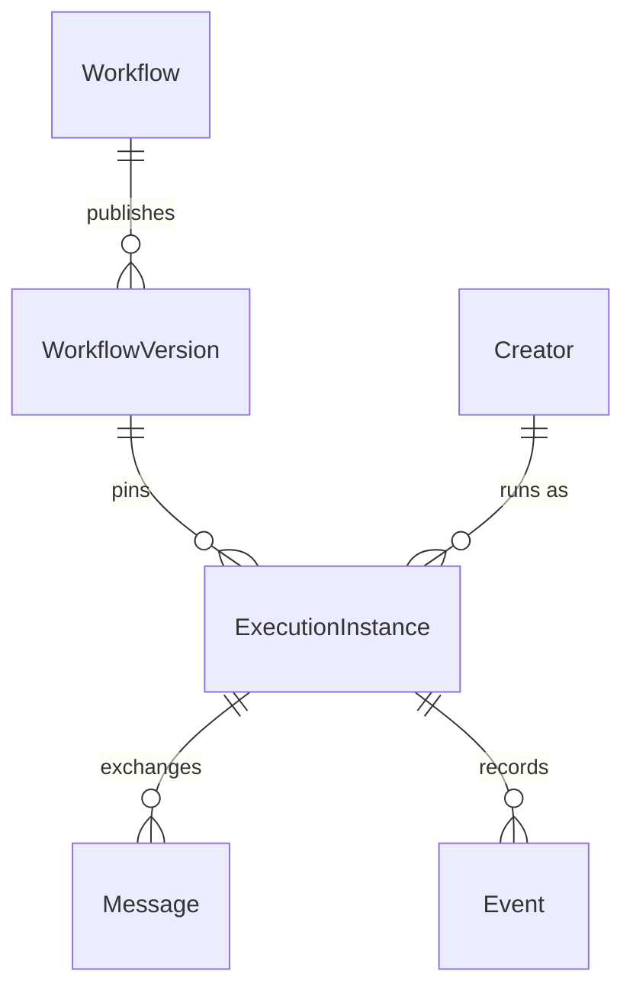
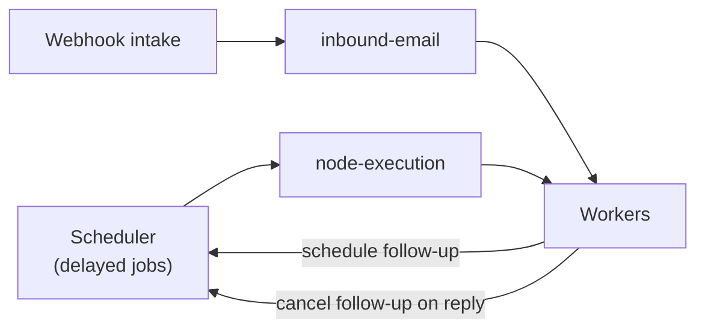
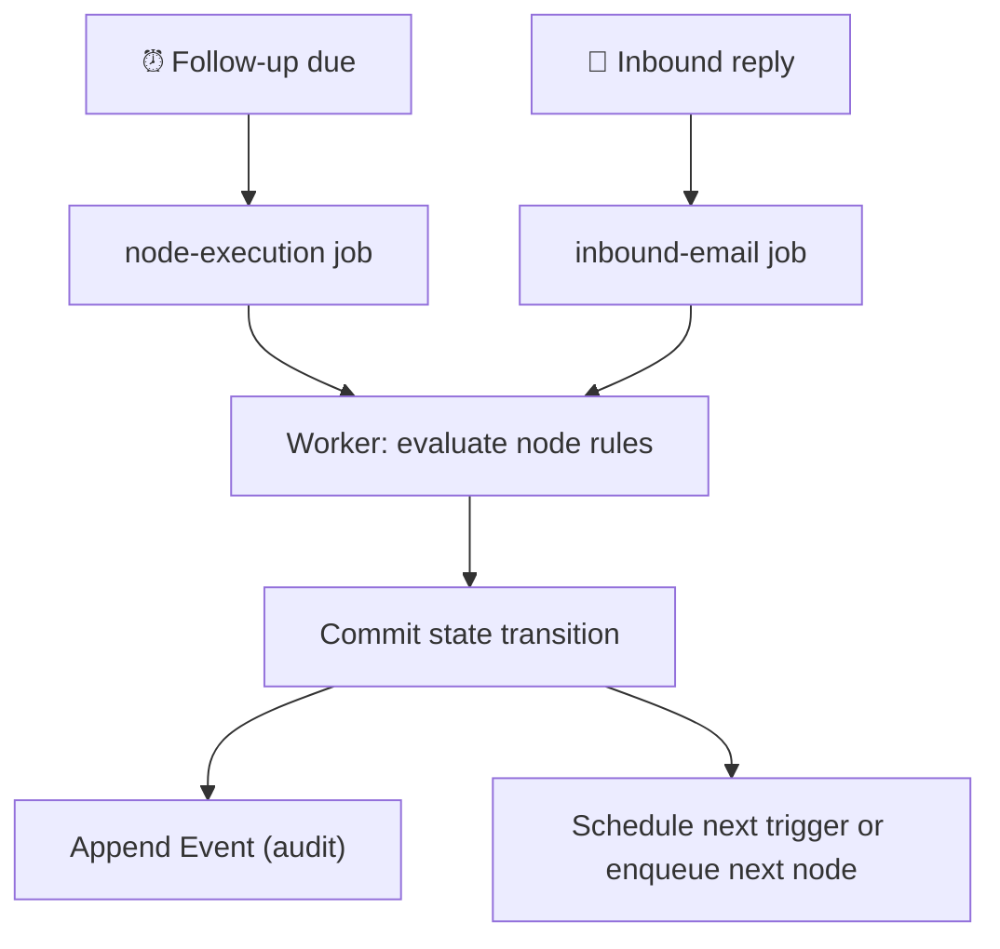
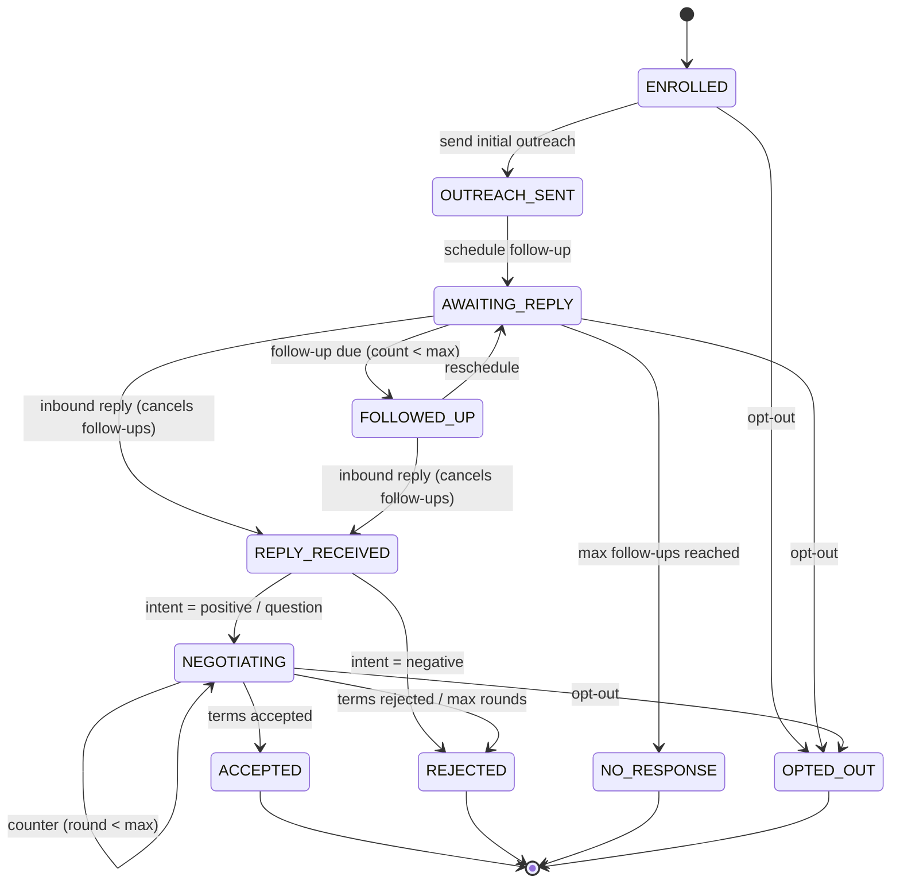

# System Architecture — Pluvus Workflow Prototype

> Architecture for validating the workflow execution model defined in
> [`source-of-truth.md`](./source-of-truth.md). Optimized for clarity and fast
> validation, not premature scale. No application code — design only.

---

## 1. System Overview

Three runtime tiers plus shared infrastructure:

- **Web tier** — React/Vite UI for visualizing the workflow pipeline and per-node creator counts; Express API for definitions, instances, and webhook intake.
- **Execution tier** — BullMQ workers that own all state transitions. The only writers of execution-instance state. Triggered by the scheduler (time) and by inbound email events.
- **Agent tier** — a Python LangGraph service exposing bounded AI operations (draft, classify, negotiate) over HTTP. Stateless; returns proposals, never commits state.

The **execution instance** is the spine of the system: every event, schedule, and queue job ultimately reads or advances one instance.

## 2. Component Responsibilities

| Component | Owns | Does NOT own |
|-----------|------|--------------|
| **React UI** | Pipeline visualization, node config display, per-node creator counts | Any execution logic |
| **Express API** | CRUD for workflows/versions/instances, webhook intake, enqueueing | State transitions, AI calls |
| **Scheduler** | Time-based triggers (follow-up due); cancellation of pending jobs on reply | Deciding *what* the transition is |
| **Queues (BullMQ)** | Durable hand-off between triggers and workers; retries; backoff | Business logic |
| **Workers** | **All** execution-instance state transitions; node completion/stop rules; calling Nylas & LangGraph | UI, webhook auth |
| **LangGraph service** | Bounded AI: draft outreach/follow-up, classify replies, run negotiation turn | Persisting state, sending email |
| **PostgreSQL/Prisma** | Source of truth for definitions, versions, instances, message log, events | Transient job state |
| **Redis** | BullMQ backing store, scheduler delayed sets | Durable domain data |
| **Nylas** | Email send + inbound delivery via webhook | Classification, scheduling |

**Invariant:** workers are the *only* writers of execution-instance state. API and agents never mutate it directly. This keeps the state machine single-threaded-per-instance and auditable.

## 3. Frontend Architecture

- **React + TypeScript + Vite + Tailwind** — app shell and styling.
- **React Flow** — renders the vertical pipeline (one node per workflow step) with collapsed-card anatomy: node name, one-line summary, and counts (in progress / waiting / failed) per the node contract.
- **Zustand** — local UI/canvas state (selection, inspector open/closed, optimistic toggles).
- **TanStack Query** — server state: workflow definitions, version list, per-node instance counts, instance detail. Polls (or later subscribes) for live counts.

The frontend is **read-mostly** for the prototype: it visualizes execution rather than driving it. The inspector shows a node's config and the instances waiting in it. No execution decisions happen client-side.

## 4. Backend Architecture

Express (TypeScript) split into thin layers:

- **HTTP routes** — workflow/version/instance CRUD; `/webhooks/nylas` for inbound email.
- **Service layer** — validates, persists via Prisma, and enqueues jobs. Never performs transitions inline.
- **Webhook handler** — verifies Nylas signature, normalizes the inbound message, persists it, and enqueues an `inbound-email` job. Responds fast (ack) so Nylas isn't kept waiting.
- **Enqueue boundary** — the single place that puts work on BullMQ. Everything downstream of a transition flows through the queue, never a direct function call into the worker.

## 5. Agent Architecture (LangGraph)

A standalone **Python** service (LangGraph + LangChain) exposing a small HTTP API. It is **stateless per call** — it receives the instance context it needs and returns a result; persistence and side effects stay in the worker.

Three bounded operations map to the in-scope nodes:

- **`draft`** — generate/personalize outreach or follow-up copy. Input: creator profile + template + tone + personalization depth. Output: subject + body.
- **`classify`** — reply classification. Input: inbound message + thread. Output: intent (`positive` / `negative` / `question` / `opt-out`) + confidence.
- **`negotiate`** — one negotiation turn as a LangGraph graph: read offer/counter, apply stop rules (max rounds, floor/ceiling terms), produce `accept` / `counter(message)` / `reject`. The **loop lives in execution state**, not in a long-running agent — each turn is a discrete call, so the worker owns termination.

This keeps AI "useful but bounded" (source of truth §1): agents propose; workers decide and commit.

## 6. Database Architecture

PostgreSQL via Prisma. Core entities (definition vs. execution split):

- **Workflow** — logical campaign definition.
- **WorkflowVersion** — immutable published snapshot (the node graph + node configs as JSON). Instances reference this.
- **Node** — captured within the version snapshot (config, completion rules, stop conditions). Not separately mutable once published.
- **Creator** — mocked creator profile (email, handle, niche, etc.).
- **ExecutionInstance** — one Creator × one WorkflowVersion. Holds `currentNodeId`, `state`, `followUpCount`, `negotiationRound`, timestamps. The unit of execution, scheduling, and audit.
- **Message** — every outbound/inbound email tied to an instance (thread id, direction, body, Nylas ids).
- **Event** — append-only log of triggers and transitions (time-due, inbound-reply, state changes) for audit and replay.

**Versioning rule:** publishing snapshots the node graph into `WorkflowVersion`. Editing a workflow creates a new version; existing instances stay pinned to their original version until explicitly migrated (source of truth §3.4).

## 7. Queue Architecture

BullMQ on Redis. Queues are the durable seam between *triggers* and *execution*. Suggested queues:

- **`node-execution`** — advance an instance through its current/next node (send outreach, send follow-up, run negotiation turn).
- **`inbound-email`** — process a classified reply and transition state.
- **`scheduler` (delayed jobs)** — follow-up timers; uses BullMQ delayed jobs keyed by instance so they can be **cancelled by id** when a reply arrives.

Properties relied on: at-least-once delivery, retries with backoff, idempotent handlers (every handler is safe to re-run; transitions guard on current state), and per-instance ordering where it matters (one in-flight job per instance for state-mutating work).

## 8. Nylas Integration Architecture

Nylas is the email boundary, used two ways:

- **Outbound (send):** workers call Nylas to send outreach/follow-up using drafts produced by LangGraph. The returned message/thread ids are persisted on `Message` so replies can be correlated.
- **Inbound (receive):** Nylas webhooks hit `/webhooks/nylas`. The handler verifies the signature, correlates the message to an instance by thread id, persists it, and enqueues an `inbound-email` job. The webhook does **not** classify or transition — it only ingests and acks fast.

This isolates the engine from email provider specifics behind a thin adapter, so Nylas could later be swapped without touching the state machine.

## 9. Event-Driven Model

The engine advances on exactly **two trigger families**:

- **Time triggers** — a scheduled follow-up becomes due (scheduler → `node-execution`).
- **Inbound triggers** — a reply arrives (webhook → `inbound-email`).

Each trigger becomes a queue job; a worker evaluates the current node's completion rule / stop conditions and commits the next state. Every trigger and transition is appended to the `Event` log, making execution auditable and (in principle) replayable.

## 10. Creator State Machine

The per-instance lifecycle (source of truth §6). A reply at any waiting state cancels pending follow-ups; negotiation is a bounded loop; opt-out is reachable from any state.

## 11. Workflow Runtime Model

How a single instance flows at runtime:

1. **Enroll** — `Import Creator List` creates an `ExecutionInstance` per mocked creator, pinned to the current `WorkflowVersion`, state `ENROLLED`.
2. **Advance via queue** — a `node-execution` job runs the current node: it reads the version's node config, calls LangGraph/Nylas as needed, applies the node's completion rule, writes the transition, and either schedules the next trigger or enqueues the next node.
3. **Wait on events** — at waiting states the instance sits idle until a trigger (time or inbound) produces the next job. No polling of instances; the scheduler and webhooks drive progress.
4. **Bounded loops** — follow-up and negotiation loops are bounded by counters stored on the instance and checked by the worker, so loops always terminate.
5. **Pinned execution** — the instance always executes against its enrolled `WorkflowVersion`, so editing the workflow never disturbs in-flight runs.

This realizes the source-of-truth claim that the **execution instance is the unit of execution, scheduling, and audit**, advanced purely by an event-driven engine.
