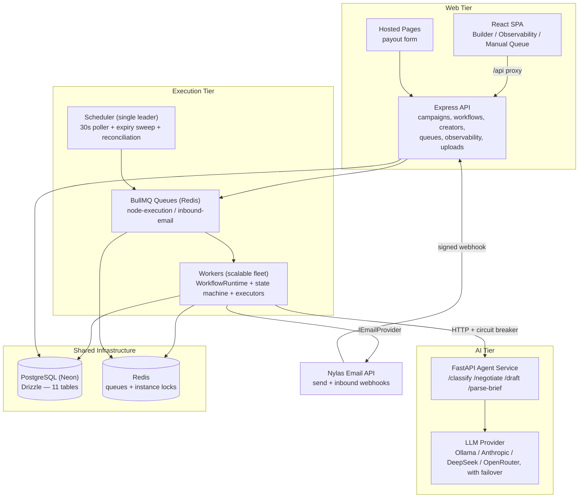
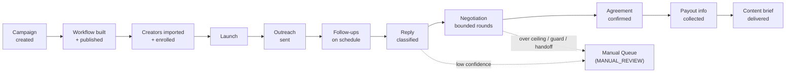
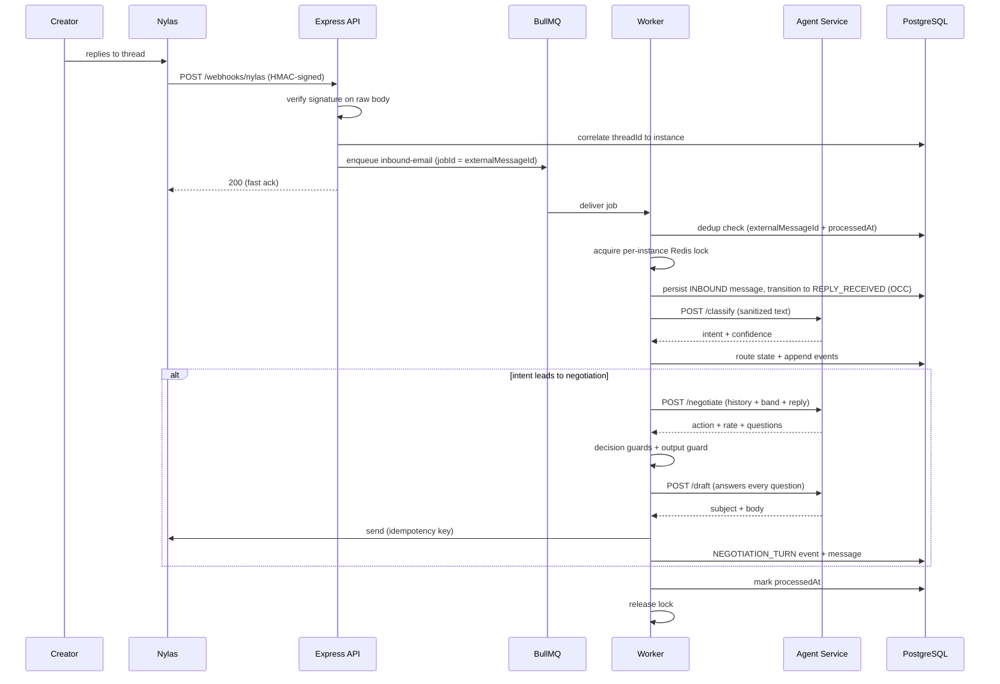
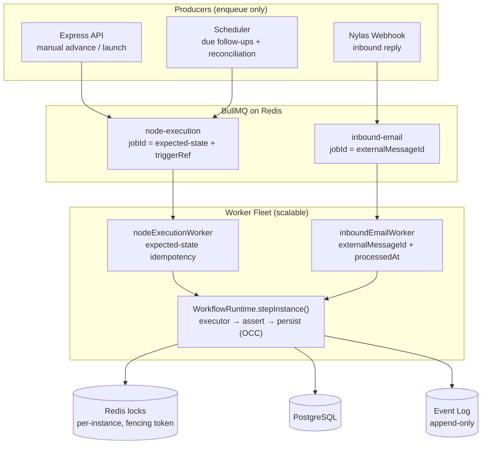
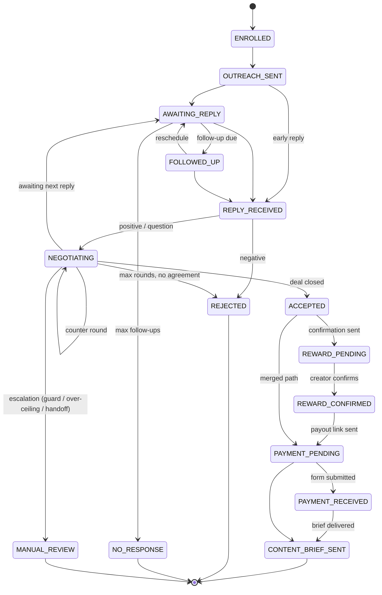
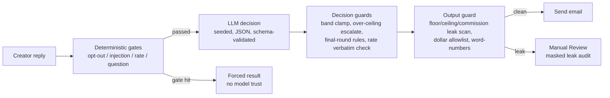

# Pluvus Workflow Platform

**An AI-assisted creator-outreach and negotiation engine** — a full-stack system that takes a brand campaign from creator enrollment through automated outreach, follow-ups, AI reply classification, bounded AI negotiation, human-in-the-loop escalation, agreement confirmation, payout collection, and content-brief delivery — with every step persisted, audited, and observable.

The platform is a three-service monorepo:

| Service | Stack | Role |
|---|---|---|
| `web/` | React 18 + Vite + React Flow + TanStack Query | Visual workflow builder, campaign wizard, live execution dashboard, manual review queue |
| `server/` | Express + TypeScript (ESM) + Drizzle/PostgreSQL (Neon) + BullMQ/Redis | REST API, state-machine execution engine, workers, scheduler, email + hosted payout form |
| `agent/` | FastAPI + LangGraph (Ollama / Anthropic / DeepSeek / OpenRouter) | AI service: reply classification, negotiation decisions, email drafting, brief parsing |

---

## Table of Contents

1. [Project Overview](#project-overview)
2. [Key Highlights](#key-highlights)
3. [Current Capabilities](#current-capabilities)
4. [Architecture](#architecture)
5. [End-to-End Workflow](#end-to-end-workflow)
6. [Product Walkthrough](#product-walkthrough)
7. [Example Creator Journey](#example-creator-journey)
8. [Workflow Engine](#workflow-engine)
9. [AI / LLM Layer](#ai--llm-layer)
10. [Frontend Architecture](#frontend-architecture)
11. [Backend / Services](#backend--services)
12. [Folder Structure](#folder-structure)
13. [Technologies Used](#technologies-used)
14. [Design Decisions](#design-decisions)
15. [Engineering Highlights](#engineering-highlights)
16. [Extensibility](#extensibility)
17. [Current Status](#current-status)
18. [Getting Started](#getting-started)
19. [Conclusion](#conclusion)

---

# Project Overview

## What the system is

Pluvus Workflow is the execution backbone for creator-marketing campaigns. A brand defines a campaign (budget band, deliverables, timeline, commission, reward, brief PDF), attaches a workflow built from configurable nodes, enrolls creators from a CSV, and launches. From that point the system runs each creator autonomously:

- sends personalized outreach and scheduled follow-ups,
- classifies every inbound reply with an LLM (guarded by deterministic gates),
- negotiates rates within a brand-set floor/ceiling band across bounded rounds,
- escalates genuine judgment calls to a human (terminal `MANUAL_REVIEW` + a brand-notification email),
- confirms the agreement, collects payout information on a hosted form,
- and delivers the campaign brief with a PDF attachment to close the loop.

Every creator is an independent **execution instance** advancing through an explicit state machine, driven purely by events (time triggers and inbound email), with an append-only audit log of every transition, message, and AI decision.

## The problem it solves

Creator outreach at scale is a per-creator state problem: who replied, who needs a nudge, who is mid-negotiation, who asked a question the last email must answer, who opted out, and which deals need a human. Form-based campaign tools cannot express this. Pluvus Workflow models it directly — explicit nodes with timing and stop rules, per-creator state, bounded AI in the loop, and human escalation as a first-class path rather than an afterthought.

## High-level architecture



## Core objectives

1. **Event-driven execution** — instances advance only on time triggers and inbound email; no polling loops "run" workflows.
2. **Correctness under concurrency** — Redis per-instance locks plus optimistic concurrency control guarantee exactly one transition per trigger.
3. **Bounded, guarded AI** — the LLM classifies, negotiates, and drafts, but deterministic code enforces every money boundary, round cap, and disclosure rule.
4. **Human-in-the-loop by design** — anything the AI cannot safely decide becomes a brand email with one-click resolution links or a Manual Queue entry.
5. **Full auditability** — append-only events, complete message logs, negotiation turn history, and per-call LLM telemetry with prompt versions.

---

# Key Highlights

- **End-to-end creator workflow automation** — one system carries a creator from enrollment through outreach, negotiation, agreement, payout collection, and content-brief delivery, with no manual step in the common path.
- **AI-powered outreach and negotiation** — an LLM classifies replies, negotiates rate within a brand-set band, and drafts every email, grounded in campaign knowledge and the parsed brief PDF.
- **Event-driven execution engine** — instances advance only on time triggers and inbound email; there is no loop that "runs" a workflow, so idle creators consume nothing.
- **Visual Workflow Builder** — a React Flow drag-and-drop canvas with live client + server validation, auto-save, and one-click publishing.
- **Campaign Builder** — a guided wizard captures commercial scope and knowledge fields that are stamped straight into the running engine's node configs.
- **Human-in-the-loop escalation** — genuine judgment calls transition to the terminal `MANUAL_REVIEW` state, fire an idempotent brand-notification email, and surface in the Manual Queue for a human to take over.
- **Immutable workflow versioning** — publishing freezes a node-graph snapshot; in-flight creators keep running their enrolled version while the draft evolves freely.
- **Queue-based architecture** — BullMQ over Redis with deterministic job IDs, retries, and idempotent workers gives effectively-once processing on an at-least-once queue.
- **AI safety guardrails** — deterministic gates before the model and decision + output guards after it enforce every money boundary, round cap, and disclosure rule in code.
- **Observability** — read-only dashboard APIs, per-instance timelines, transition traces (source/worker/job), and per-call LLM telemetry (model, prompt version, tokens, latency, cost).
- **Correctness under concurrency** — Redis per-instance locks plus optimistic concurrency control guarantee exactly one transition per trigger, even under racing workers.
- **Production-oriented architecture** — role-split processes (API / scalable workers / Redis leader-locked single-leader scheduler), circuit-broken AI calls, graceful shutdown, and env-driven provider selection from fully-mocked local to real Nylas + a hosted LLM (Anthropic / DeepSeek via OpenRouter).

---

# Current Capabilities

## Campaign Builder

A two-step campaign wizard (`web/src/components/builder/CampaignWizard.tsx`) captures everything the AI and the emails need:

- **Identity:** campaign name, brand name, objective, notes.
- **Commercial scope:** deliverables (e.g., "3 Instagram Reels + 1 YouTube integration"), timeline, product/sample reward description, and a **ships-physical-product** toggle that adds shipping-address collection to the payout form.
- **Knowledge fields** (fed verbatim to the AI so it answers creator questions truthfully): brand description, usage rights, exclusivity, payment terms, attribution window.
- **Escalation routing:** a per-campaign `notifyEmail` where manual-review notifications are sent when an instance is escalated to a human.

Campaign fields are **stamped into workflow node configs** at creation, on every draft save, and at publish — so the running engine always reflects the campaign's current commercial terms.

## Workflow Builder

A full drag-and-drop graph editor built on React Flow (`web/src/components/builder/`):

- **Node palette** with drag-to-canvas or click-to-append; nodes connect via visible handles.
- **Three campaign templates** to start from: `affiliate` (commission-only), `hybrid` (base fee + commission), `fixed_fee` (flat payment) — each pre-configures outreach copy, follow-up intervals, budget bands, and negotiation round caps.
- **Live validation** on both client and server: exactly one start node, exactly one terminal node, correct phase ordering, no cycles/orphans/branches, per-node config checks (a Content Brief node requires an uploaded PDF). Issues are clickable and focus the canvas on the offending node.
- **Auto-save** with a 1-second debounce and visible save state; **Tidy Layout** re-arranges the canvas.
- **Publish** creates an immutable `WorkflowVersion` snapshot; in-flight creators keep executing the version they enrolled under while the draft evolves freely.
- **Version history** with instance counts per published version.

## Creator Import and Enrollment

- CSV upload with a hand-rolled, robust parser (quoted fields, BOM, CRLF); header mapping is case/space-insensitive; unknown columns are preserved as creator metadata.
- Bulk upsert keyed on email with per-row validation results (created / updated / skipped and why).
- Roster view with search across name, email, handle, platform, niche; batch selection and one-click enrollment into the latest published version.
- Launch gate re-validates the published graph, then enqueues execution jobs for every enrolled creator.

## Workflow Execution

The engine turns every trigger into a queued job that a worker processes exactly once. In brief (the mechanics are detailed in [Queue and worker architecture](#queue-and-worker-architecture) and [Execution model](#execution-model)):

- **Two BullMQ queues** — `node-execution` and `inbound-email` — with deterministic job IDs, three attempts, and exponential backoff.
- **Idempotent workers:** node execution guards on expected state; inbound email guards on `externalMessageId` **and** a `processedAt` marker so a persisted-but-unprocessed reply is never lost.
- **Scheduler (single leader, Redis-locked)** runs every 30 seconds: fires due follow-ups (batch-limited, index-backed), reconciles instances stranded in transient states after a crash, and logs worker-fleet metrics. A Redis leader lease means that even if several `scheduler` processes are launched, only one polls — so no duplicate executor firing or duplicate LLM spend.
- **Concurrency protection:** per-instance Redis locks with fencing tokens serialize execution; optimistic concurrency control (`UPDATE … WHERE currentState = expected`) is the correctness guarantee — a losing writer becomes a clean no-op, never a double transition.
- **Process topology:** one codebase, role-selected at start (`PROCESS_ROLE = api | worker | scheduler | all`). Docker Compose ships a split topology with a horizontally scalable worker fleet and a single scheduler leader.

## AI Reply Classification

Every inbound creator reply is classified into one of six intents — `POSITIVE / NEGATIVE / QUESTION / OPT_OUT / UNKNOWN / DEFERRED` — with a layered pipeline:

1. **Deterministic gates first** (shared spec, `shared/classifier-spec.json`): opt-out keywords force `OPT_OUT` at confidence 1.0 (compliance-critical, can never be suppressed); prompt-injection patterns force `UNKNOWN`; rate statements and questions short-circuit as engaged replies.
2. **LLM classification** on sanitized text (temperature 0; genuinely seeded + JSON-mode on Ollama, temperature-0 + JSON-repair on the hosted providers).
3. **Low-confidence gate:** anything below 0.50 confidence degrades to `UNKNOWN`, which routes the creator to Manual Review rather than guessing.
4. **Routing:** `POSITIVE`/`QUESTION` → negotiation, `NEGATIVE` → `REJECTED`, `OPT_OUT` → `OPTED_OUT`, `DEFERRED` ("I'll think about it") → back to `AWAITING_REPLY` with a soft follow-up scheduled, `UNKNOWN` → `MANUAL_REVIEW`.

## AI Negotiation

The negotiation node conducts a bounded back-and-forth on rate, within a brand-set floor/ceiling band. The provider abstraction, determinism controls, and guard stack behind it are detailed in the [AI / LLM Layer](#ai--llm-layer):

- **Two strategies**, selected by `NEGOTIATION_STRATEGY`:
  - **`llm`** — the model reads the full negotiation history and picks the action *and* the rate (temperature 0.3, seeded). Every decision then passes through deterministic guards.
  - **`rules`** — the model only classifies intent and extracts the creator's stated rate; deterministic code makes the money decision. This path is also the **automatic fallback** whenever the LLM path fails for any reason.
- **Five actions:** `ACCEPT`, `COUNTER`, `PRESENT_OFFER` (restate standing offer without burning a round), `REJECT`, `ESCALATE`.
- **Hard guards, enforced in code:** counters clamp to the band; an `ACCEPT` above the ceiling becomes `ESCALATE` (the system never auto-agrees above budget); on the final round a counter is coerced to close the deal *unless* the creator's own ask exceeds the ceiling — that escalates instead of fabricating an acceptance; extracted rates are validated digit-for-digit against the creator's actual reply so a hallucinated figure can never enter the money path; ranges and per-unit prices are rejected rather than guessed.
- **Comprehension threading:** the negotiate step emits `creatorQuestions` and `pushedFixedTerms` (creator tried to change commission/perk/deliverables/timeline); the draft step must answer every question and explicitly state which terms are fixed. An answer-coverage verifier re-drafts if any question was missed.
- **Full money trail:** every turn is persisted as a `NEGOTIATION_TURN` event (round, action, rate, message); history and the current standing offer are reconstructed from these events, and the final agreed fee is resolved from the same trail.

## AI Email Drafting

Purpose-specific prompts generate the actual outbound copy: initial outreach, follow-up, counter-offer/acceptance, and onboarding/reward confirmation. Drafts are grounded in campaign knowledge fields and the parsed brief PDF, carry the full conversation history as data (not instructions), answer the creator's open questions in a checklist, and pass output guards before anything is sent:

- **Disclosure guard** (`server/src/engine/guards/outputGuard.ts`): scans drafts for the internal floor/ceiling as digits *and as spelled-out words* ("fifteen hundred dollars"), commission percentages near the word "commission", configured internal terms, and enforces a dollar-amount allowlist — every explicit `$` amount must be either the intentionally presented rate, the creator's own stated ask, or an amount from brand copy. A hit blocks the send and escalates to Manual Review with masked leak details.
- **Brand scrubbing and format checks:** no platform name leakage, no placeholder tokens, enforced greeting/sections/sign-off structure.
- **Idempotent sends:** outbound AI messages carry a deterministic pre-send idempotency key so retries can never double-send.

## Human-in-the-Loop: Escalation and the Manual Queue

Escalation is a **one-way handoff to a human**, not an in-band negotiation loop. When the system hits a business-judgment call, an over-ceiling ask, a guard block, a low-confidence reply, or a missing-configuration case, the instance transitions to the terminal `MANUAL_REVIEW` state and the brand is notified by email — a person then takes over out of band. (An earlier design parked instances in an `AWAITING_BRAND_DECISION` state with tokenized magic-link approvals; the founders' Phase A decision **removed that loop** in favour of the simpler terminal handoff, so no `AWAITING_BRAND_DECISION` state, `BrandDecision` model, or approval magic-links exist in the current system.)

- **Entry into `MANUAL_REVIEW` is a deliberate, machine-reasoned decision** with a reason code: `max_rounds_reached`, `low_confidence_reply`, `output_guard_blocked`, `escalated` (agent chose to hand off), `no_ceiling_configured`, `agent_unavailable`, the Phase E always-escalate topics (`legal_or_contract`, `dispute_or_hostile`, `pricing_exception`, `usage_rights_or_licensing`), and `missing_brand_name`.
- **Brand notification** is an email to the campaign's `notifyEmail` (falling back to `BRAND_NOTIFY_EMAIL`, then an operator default), recorded in a `BrandNotification` row with `SENT`/`FAILED`/`SKIPPED` status. It is idempotent per `(instance, reason)` and best-effort — a notification failure never rolls back or blocks the state transition.
- The **Manual Queue tab** surfaces every escalated creator with the derived reason, brand-notification delivery status, and a re-notify action (which forces a fresh send even after a prior `SENT`).
- Max-rounds-with-no-agreement instead resolves to the terminal `REJECTED` state with a best-effort close email, per the founders' round-limit rule — not a human handoff.

> An in-product "resume from `MANUAL_REVIEW`" action (a return path from the terminal handoff) is tracked as post-pilot work; today, recovery from a human-reviewed instance is out of band.

## Agreement, Payout, and Content Brief

After a successful negotiation the deal is operationalized:

- **Reward Setup** — sends a "Campaign Agreement Confirmation" email stating the final fee, commission, and deliverables; the creator's reply (agreement / question / denial) is classified and advances the instance to `REWARD_CONFIRMED`.
- **Payment Info** — emails a hosted payout form link (token-secured, 30-day expiry). The server-rendered form collects method (`PAYPAL` / `WISE` / `BANK_TRANSFER`), account identifier, country, notes — and a shipping address when the campaign ships a physical product. Submission advances `PAYMENT_PENDING → PAYMENT_RECEIVED`; re-submission is idempotent and self-healing. Email replies during this phase get an automatic "the rate is fixed" response without disturbing the wait.
- **Content Brief** — the merged post-negotiation node sends the finalized offer, the payout link, a referral link, and the campaign brief **PDF attachment**, completing the journey at the success terminal `CONTENT_BRIEF_SENT`. Brief PDFs are uploaded through the builder (magic-byte validated, 10 MB cap) and stored behind a swappable local-storage seam; the agent service parses the PDF text so drafts can answer brief-specific questions.

## Communication Layer

- **`IEmailProvider` interface** with two implementations: a deterministic mock (harness/dev) and a **Nylas provider** — real sends with HTML wrapping, base64 attachments, reply-to support, and authoritative thread-ID resolution for correlation.
- **Nylas webhook intake:** challenge echo for endpoint verification, HMAC-SHA256 signature verification over the raw body, thread-ID correlation to the owning instance, fast ack, and enqueue — the worker owns all state changes.
- Replies arriving in "wrong" states are buffered, not lost: dedicated transition edges let a reply land while outreach is still settling or mid-negotiation.

## Observability

- **Read-only dashboard APIs** (`/observability/*`): workflow summary, filtered/paginated instance lists, per-instance detail (messages, events, decisions), chronological timelines, and transition traces recording source/worker/job for every state change.
- **Worker-fleet metrics:** live queue depths and stuck-state counts.
- **LLM telemetry (durable):** every AI call records model, prompt version, latency, input/output tokens, and estimated cost. Beyond the agent's in-process `/metrics` ring buffer, each call is persisted server-side to an `LlmCall` table — attributed to the originating instance and role via AsyncLocalStorage — and aggregated by `GET /observability/llm` (all-time + trailing-24h totals, per-role and per-model breakdowns) with a dashboard usage strip and a per-instance "AI Usage" inspector tab.
- **Frontend Observability view:** state-distribution tiles, terminal/active splits, instance inspector with timeline, message thread (with classified intent and confidence), agent decisions, and logs — all live-polling.

## Evaluation Framework

- **500-case end-to-end dataset** (`agent/tests/negotiation_eval/dataset_500/`) exercising classify → negotiate → draft with machine assertions per case: expected action, rate bounds, comprehension outputs, and draft completeness. Banks cover money math, multi-question replies, answerable/deferred questions, injection, opt-out, negatives, unrelated messages, escalation classes, and 30 multi-turn conversations.
- **CI eval gate:** the deterministic classification eval (macro F1 ≥ 0.90, per-intent F1 ≥ 0.80, **opt-out recall = 1.0**) and a 22-case negotiation gate run on every push/PR; live-model evals are opt-in flags.
- **Prompt versioning:** every prompt carries a version (`classify-v1.0`, `llm-negotiate-v1.2`, `offer-v1.4`, …) stamped onto telemetry, making eval results attributable to an exact prompt revision.

## Persistence and Audit

Eleven tables over PostgreSQL (Neon), accessed through **Drizzle ORM**, with three invariants: definition models are mutable, published version snapshots are immutable, and the event log is append-only. Unique constraints encode the idempotency keys (message external IDs, outbound send keys, notification keys, payout tokens). The 21 SQL migrations under `server/prisma/migrations/` remain the migration-SQL owner and are applied by a small runner (`apply-migration.ts`); the Prisma *runtime* has been fully removed (migration M1) — no `@prisma/client` is imported anywhere. On the money path nothing is updated in place: the agreed fee is recovered by replaying `NEGOTIATION_TURN` events, and (W-7) the state write and that event append now commit in a single transaction so a crash can never strand a state change without its money trail.

---

# Architecture

## Overall shape

Three independently deployable services communicate over well-defined seams:

- **Web ↔ Server:** REST over a Vite `/api` proxy. The UI is read-mostly; every mutation is an explicit API call.
- **Server ↔ Agent:** HTTP with bearer auth, per-route timeouts, and a **circuit breaker** (5 consecutive failures open the circuit for 30 s; while open, orchestration degrades to Manual Review instead of hammering a dead backend).
- **Server internal:** the queue is the seam between *eventing* (API, webhook, scheduler) and *execution* (workers). Workers are the **only writers** of instance state.
- **Server ↔ Email:** the `IEmailProvider` interface; Nylas and mock implementations are interchangeable via one env var.

## Module responsibilities

| Module | Responsibility |
|---|---|
| `server/src/engine/` | Pure execution engine: state machine, runtime, node executors, output guards. Knows nothing about HTTP, queues, or Redis. |
| `server/src/workers/` | BullMQ queues + idempotent workers wrapping the runtime. |
| `server/src/scheduler/` | Poller (Redis leader-locked so only one of N scheduler processes acts): due follow-ups, stuck-instance reconciliation, fleet metrics. |
| `server/src/db/` | Typed repository layer over Drizzle; the OCC primitive lives here. |
| `server/src/routes/` | REST surface: builder, ops, observability, hosted payout form, uploads. |
| `server/src/webhooks/` + `providers/nylas/` | Signed inbound intake and the real email provider. |
| `server/src/adapters/` | HTTP clients to the agent service (classification + negotiation) with breaker/timeouts, plus in-process mocks. |
| `server/src/notifications/` | Idempotent brand escalation notifications (on entry to `MANUAL_REVIEW`). |
| `server/src/templates/` | Campaign workflow templates and node-graph validation. |
| `server/src/storage/` | Swappable file-storage seam (brief PDFs). |
| `server/src/validation/` | Structural graph validation (mirrored client-side). |
| `server/src/observability/` | Dashboard repository + DTOs. |
| `agent/app/` | FastAPI routes, LLM abstraction with failover, injection defense, structured-output enforcement, telemetry, PDF parsing. |
| `web/src/` | SPA: builder, wizard, enrollment, monitoring, manual queue, observability; design system; API client. |
| `shared/` | `classifier-spec.json` — single source of truth for deterministic classification gates, consumed by both Python and TypeScript with parity fixtures. |

## Data flow

1. **Definitions flow down:** Campaign → Workflow draft → immutable `WorkflowVersion` snapshot → `ExecutionInstance` pinned to that snapshot.
2. **Events flow in:** scheduler ticks and Nylas webhooks become queue jobs.
3. **Workers execute:** load context → dispatch executor → validate transition → persist with OCC → append events → schedule next trigger.
4. **AI is consulted, never trusted blindly:** agent responses pass through decision guards and output guards before touching state or email.
5. **Reads flow up:** the dashboard and builder read via repositories and DTOs; the UI never sees raw ORM objects.

---

# End-to-End Workflow

The complete creator journey:



Step by step:

1. **Campaign creation** — the wizard captures brand identity, budget-relevant scope, knowledge fields, reward, and the escalation email; a workflow is created from a template under the campaign.
2. **Workflow authoring** — the graph is edited on the canvas, node configs tuned (follow-up intervals, max rounds, budget band, opening-offer position, templates), validated live, and published as an immutable version.
3. **Enrollment and launch** — creators arrive via CSV, are enrolled into the published version (one instance per creator per version), and launch enqueues the first execution job for each.
4. **Outreach and follow-ups** — the outreach executor drafts (AI or template) and sends the first email; the follow-up executor schedules `dueAt`; the 30-second poller fires due follow-ups until a reply arrives or the max count exhausts to `NO_RESPONSE`. A reply cancels follow-ups implicitly by moving the instance out of the poller's view.
5. **Reply processing** — the webhook verifies, correlates, and enqueues; the worker dedups, locks, persists the inbound message, classifies it, and routes: positive/question → negotiation, negative → rejected, opt-out → opted out, unknown/low-confidence → Manual Review.
6. **Negotiation** — each creator reply triggers one turn: the agent decides (LLM or rules), guards clamp/veto, the draft answers every question, the output guard clears the copy, the email sends idempotently. Rounds are capped; over-ceiling asks and guard blocks escalate to the terminal `MANUAL_REVIEW` (with a brand notification), and max-rounds-with-no-agreement resolves to the terminal `REJECTED` — a one-way handoff, no brand-decision round-trip.
7. **Agreement → payout → brief** — confirmation email and creator acknowledgment, hosted payout form (plus shipping address when applicable), then the brief email with PDF attachment lands the instance at `CONTENT_BRIEF_SENT` — the success terminal.

## Inbound reply sequence



## Queue and worker architecture

Every trigger — an API call, a signed webhook, or a scheduler tick — becomes a queue job; workers are the single writer of instance state, and every step lands in the append-only event log.



---

# Product Walkthrough

> The ten primary screens of the product, in the order a user encounters them.

**Campaign Dashboard** — the landing grid of all campaigns with brand, objective, and workflow/published counts; the entry point for creating or opening a campaign.

**Campaign Builder** — the two-step wizard that captures identity, commercial scope, knowledge fields, reward, shipping flag, and the escalation email, then picks a workflow template.

**Workflow Builder** — the five-tab workspace (Build / Enroll / Launch / Monitor / Manual Queue) with the node index sidebar, config panel, and publish bar.

**Workflow Canvas** — the React Flow graph editor: draggable nodes, connectable handles, minimap, and live validity ring per node.

**Node Configuration** — the right-hand panel with type-specific forms (templates, intervals, budget band, max rounds, brief-PDF upload) and save state.

**Creator Enrollment** — CSV import, searchable roster, batch selection, and enrollment results into the latest published version.

**Launch Screen** — precondition checks (published version, enrolled creators) and the launch confirmation that enqueues the first job per creator.

**Live Monitoring** — state-distribution tiles, per-state creator lists, and the instance inspector, polling for live updates.

**Manual Queue** — escalated creators (in `MANUAL_REVIEW`) with derived reasons, brand-notification delivery status, and a re-notify action.

**Observability Dashboard** — the read-only instance explorer: timelines, message threads with classified intent and confidence, agent decisions, and transition logs.

---

# Example Creator Journey

A concrete walk-through of one realistic creator — **Jane Doe** (`jane@example.com`, fitness, Instagram) — enrolled in a **hybrid** campaign (base fee + commission), band **$200–$2000**, max **4** rounds. Each step names what happens, which service performs it, where AI is involved, what is persisted, and which events are generated.

**1. Enrollment.** Jane is imported from CSV and enrolled into the published version. *Service:* server (creators + workflows routes → repository). *AI:* none. *Persisted:* `Creator` row (upsert on email), one `ExecutionInstance` at `ENROLLED` pinned to the version. *Events:* none yet.

**2. Launch → outreach.** Launch enqueues a `node-execution` job; a worker runs the outreach executor, which drafts the first email and sends it. *Service:* server (API enqueues → worker → runtime → `IEmailProvider`); AI service drafts the copy when AI drafting is enabled. *AI:* `/draft` (`initial_outreach`), grounded in brand description + reward + deliverables. *Persisted:* `OUTBOUND` `Message` (with idempotency key), instance → `OUTREACH_SENT`. *Events:* `OUTREACH_DRAFTED`, `STATE_TRANSITION`.

**3. Follow-up scheduling.** The follow-up executor sets `dueAt = now + interval`; the instance parks at `AWAITING_REPLY`. *Service:* server (runtime + scheduler). *AI:* none. *Persisted:* `dueAt`, instance → `AWAITING_REPLY`. *Events:* `NODE_ENTERED`, `STATE_TRANSITION`. If Jane stays silent, the 30-second poller fires each due follow-up (`FOLLOW_UP_DUE`) until she replies or `maxCount` exhausts to `NO_RESPONSE`.

**4. Jane replies "Interested — I usually charge $1500 per reel. What's the timeline?".** Nylas delivers a signed webhook; the API verifies, correlates the thread to Jane's instance, and enqueues an `inbound-email` job. The worker dedups, locks, persists the reply, and classifies it. *Service:* server (webhook + worker) → agent (`/classify`). *AI:* classification — deterministic gates first, then LLM; here it resolves `POSITIVE`. *Persisted:* `INBOUND` `Message` (with `externalMessageId`, `senderEmail`, `replyIntent`, `classifyConfidence`, `processedAt`), instance → `REPLY_RECEIVED` → `NEGOTIATING`. *Events:* `INBOUND_REPLY_RECEIVED`, `REPLY_CLASSIFIED`, `STATE_TRANSITION`.

**5. Negotiation round.** The negotiation executor calls the agent with the band, history, and Jane's reply. The model reads `$1500` (a valid ask **inside** the $200–$2000 band) and returns a `COUNTER`; decision guards clamp it to the band and validate the extracted rate digit-for-digit against Jane's actual text. The draft answers her timeline question and states which terms are fixed; the output guard confirms no floor/ceiling leak; the email sends idempotently. *Service:* server (runtime + guards) → agent (`/negotiate` then `/draft`). *AI:* negotiation decision + email drafting, with `creatorQuestions = ["what's the timeline?"]` threaded into the draft. *Persisted:* `NEGOTIATION_TURN` event (round, action, rate, message), `OUTBOUND` `Message`, `negotiationRound` incremented, instance stays `NEGOTIATING`. *Events:* `NEGOTIATION_TURN`, `STATE_TRANSITION` (self).

**6. Agreement.** Jane accepts the counter. The next turn resolves to `ACCEPT` at the agreed rate (within the band, so no escalation). *Service:* server → agent. *AI:* negotiation decision (accept). *Persisted:* final `NEGOTIATION_TURN`, instance → `ACCEPTED`. *Events:* `NEGOTIATION_TURN`, `STATE_TRANSITION`.
   *(Had Jane instead demanded $2500 — above the ceiling — the guard would have forced `ESCALATE`: the instance would transition to the terminal `MANUAL_REVIEW`, email the brand's `notifyEmail` so a human can take over, and stop there. See [Human-in-the-Loop](#human-in-the-loop-escalation-and-the-manual-queue).)*

**7. Reward confirmation.** The reward-setup executor emails a "Campaign Agreement Confirmation" stating the final fee, commission, and deliverables; Jane's acknowledgment is classified as agreement. *Service:* server → agent (classify the reply). *AI:* reply classification. *Persisted:* `OUTBOUND` `Message`, instance `ACCEPTED → REWARD_PENDING → REWARD_CONFIRMED`. *Events:* `REWARD_SETUP_SENT`, `REWARD_CONFIRMED`, `STATE_TRANSITION`.

**8. Payout collection.** The payment executor emails a token-secured hosted form link (30-day expiry); Jane submits her method, account, and country. *Service:* server (executor sends the link; the hosted page + POST handler process the submission). *AI:* none. *Persisted:* `PaymentInfo` row (method, account, country), instance `REWARD_CONFIRMED → PAYMENT_PENDING → PAYMENT_RECEIVED`. *Events:* `PAYMENT_INFO_SENT`, `PAYMENT_RECEIVED`, `STATE_TRANSITION`.

**9. Content brief → completion.** The content-brief executor sends the finalized offer, payout link, referral link, and the campaign brief **PDF attachment**. *Service:* server (runtime + Nylas send with attachment). *AI:* none (the brief text was parsed earlier to ground drafts). *Persisted:* `OUTBOUND` `Message`, instance → `CONTENT_BRIEF_SENT` (success terminal), `completedAt` stamped. *Events:* `CONTENT_BRIEF_SENT`, `STATE_TRANSITION`.

At every step the transition trace records its source, worker, and job, so Jane's entire journey is reconstructable from the event log alone — visible in the Observability instance inspector.

---

# Workflow Engine

## Nodes

Nine node types (`NodeType` enum), each with a dedicated executor in `server/src/engine/executors/`:

| Node type | Executor(s) | Purpose |
|---|---|---|
| `IMPORT_CREATOR_LIST` | `importCreatorList.ts` | Entry gate; advances the node pointer for enrolled creators. |
| `INITIAL_OUTREACH` | `initialOutreach.ts` | Drafts + sends the first email (AI or template), with disclosure-guard check on AI copy. |
| `FOLLOW_UP` | `followUp.ts` | Schedules and sends interval-based reminders; enforces `maxCount`; exhaustion → `NO_RESPONSE`. |
| `REPLY_DETECTION` | `replyDetection.ts` | Classifies the inbound reply and routes; confidence < 0.50 → Manual Review. |
| `NEGOTIATION` | `negotiation.ts` | One bounded negotiation turn per reply; reads history from events; escalates on max rounds / over-ceiling / guard block. |
| `REWARD_SETUP` | `rewardSetup.ts`, `rewardReply.ts` | Agreement-confirmation email; classifies the creator's acknowledgment. |
| `PAYMENT_INFO` | `paymentInfo.ts`, `paymentReply.ts` | Sends the payout-form link; processes form submission; auto-replies "rate is fixed" to emails. |
| `CONTENT_BRIEF` | `contentBrief.ts` | Merged post-negotiation node: finalized offer + payout link + brief PDF; completes to the success terminal. |
| `END` | `end.ts` | Legacy terminal sink. |

## State machine

Sixteen `InstanceState` values with an explicit transition table (`server/src/engine/stateMachine.ts`); `assertTransition` runs before every persist, so an illegal move can never reach the database. Negotiation escalations route straight to the terminal `MANUAL_REVIEW` (guard block / over-ceiling / agent handoff) or `REJECTED` (max rounds, no agreement) — there is no in-band brand-decision loop.



Not drawn for readability, but enforced in the table: `OPTED_OUT` is reachable from every live state the creator can speak in, and `MANUAL_REVIEW` is reachable from every non-terminal decision point. **Terminal states:** `CONTENT_BRIEF_SENT` (success), `REJECTED`, `OPTED_OUT`, `NO_RESPONSE`, `MANUAL_REVIEW`.

## Execution model

Every advancement follows one template (`WorkflowRuntime.stepInstance`):

```
Load context → dispatch executor → assert transition → persist (OCC-guarded)
→ append domain event → append STATE_TRANSITION event → schedule next trigger
```

- Executors are **pure functions** returning a `NodeResult` (next state, node pointer, counters, `dueAt`, event); the runtime owns all persistence and audit writes.
- **OCC:** `updateInstanceStateConditional` adds `WHERE currentState = expected`; a conflict raises `StaleInstanceError`, which workers treat as a clean skip.
- **Locks:** `acquireLock/releaseLock` with fencing tokens serialize execution per instance; the inbound-email worker deliberately *throws* on a busy lock (retry later) so a creator reply is never dropped.
- **Reconciliation:** a sweep re-enqueues instances stuck in transient states for more than 10 minutes (crash between commit and enqueue), with bucketed deterministic trigger refs so overlapping sweeps dedup. An `OutboxJob` table provides the transactional-outbox seam.

## Configuration, validation, storage

- Node config is JSON on the node snapshot: templates, intervals, `maxCount`, `maxRounds`, budget band (`minBudget`/`maxBudget` or `termFloor`/`termCeiling`), `commissionRate`, `recommendedOfferPosition` (where in the band the opening offer sits), knowledge fields, `briefFileRef`, internal-terms list for the disclosure guard.
- Graph structure lives in a `_graph` sidecar per node (edges + canvas positions), ignored by the runtime; legacy linear drafts fall back to order-implied edges.
- Validation is mirrored: `web/src/workflow/graphValidation.ts` for instant feedback, `server/src/validation/graphValidation.ts` as the authoritative gate at draft-save, publish, and launch.
- Publishing snapshots the entire graph into `WorkflowVersion.nodeGraph`; instances pin to a version forever (snapshot versioning).

---

# AI / LLM Layer

## Agent service surface

| Endpoint | Purpose |
|---|---|
| `POST /classify` | Reply intent + confidence, behind deterministic gates. |
| `POST /negotiate` | Action + rate decision with full history; emits `creatorQuestions`, `pushedFixedTerms`, validated `creatorRequestedRate`. |
| `POST /draft` | Purpose-specific email generation (outreach, follow-up, offer, onboarding) with completeness verification. |
| `POST /parse-brief` | PDF → normalized text (4000-char cap) for draft grounding. |
| `GET /health`, `GET /metrics` | Liveness and telemetry aggregates. |

All AI routes support bearer-token auth (`AGENT_API_KEY`) and per-client rate limiting.

## Provider abstraction and determinism

- One switch (`LLM_PROVIDER`) selects the backend — **Ollama** (local Qwen, default `qwen3:8b`, optional immutable digest pin), **Anthropic** (Claude, default `claude-opus-4-8`), **DeepSeek**, or **OpenRouter** — with **per-role overrides** (`LLM_PROVIDER_NEGOTIATE|CLASSIFY|DRAFT`). The accepted hosted-production path is **OpenRouter-only**: a single `OPENROUTER_API_KEY` gateway serving Claude Opus (decision path) and DeepSeek (drafting) via per-role `OPENROUTER_MODEL_<ROLE>`. There is no OpenAI provider. An optional **failover provider** is tried automatically when the primary fails, with per-candidate wall-clock timeouts so a hung primary cannot starve the fallback.
- **Determinism controls, provider-dependent:** on **Ollama** the call is genuinely deterministic — fixed seed (42), `top_p` 1.0, and `format="json"`. Hosted providers (Anthropic / DeepSeek / OpenRouter) don't expose a seed, so they rely on temperature-0 prompting plus JSON-repair re-asks rather than bit-for-bit determinism. Per-purpose temperatures apply throughout — 0 for classification and extraction, low for negotiation decisions, higher for email copy (temperature is gated off for models that reject it, e.g. Opus 4.7+).
- **Structured output enforcement:** every response is parsed, schema-validated (Pydantic), and repaired with bounded retries; exhausted retries fail *safe* (classify → `UNKNOWN`, negotiate → rules fallback, never a silent guess).
- **Timeout discipline at both layers:** Python bounds each model invoke (60 s default); the TypeScript client applies route-level timeouts (120 s generation, 45 s classify) sized so a generation plus one repair retry completes.

## Prompt flow and context handling

Untrusted creator text is normalized (NFKC, control-character strip, 4000-char cap), sanitized (role markers neutralized, delimiter tags stripped), and embedded in prompts as **tagged data blocks, never instructions**. Negotiation and draft prompts receive the campaign's confidential band, knowledge fields, brief text, and the full conversation history; the model's output contract requires addressing every question and every pushed fixed term.

## Decision making and safety



If guards alter the model's decision, the model's advisory draft is discarded and copy is re-drafted from the guarded decision — the email always matches what was actually decided.

## Server-side integration

The TypeScript side calls the agent through `agentServiceClient.ts`: bearer auth, per-route timeouts, redacted error logging, and a circuit breaker (threshold 5, cooldown 30 s). While the circuit is open the pipeline degrades deliberately: classification returns `UNKNOWN` (→ Manual Review) and negotiation escalates — creators are never left hanging on a dead AI backend. Mock providers (`AGENT_PROVIDER=mock`) run the entire engine offline for harnesses and CI.

## Observability and evaluation

Every LLM call emits a structured record — model, prompt version, latency, tokens, estimated cost, error kind — to logs and an in-process ring buffer surfaced at `/metrics`. The eval stack (unit tests, deterministic CI gates, the 500-case live dataset runner) asserts behavior per prompt version, so a prompt change is measurable before it ships.

---

# Frontend Architecture

## Views and routing

A single-page app with hash routing (`#/campaigns`, `#/builder/<workflowId>`, `#/observe`) synchronized to component state — back/forward navigation works without a router dependency. The Observability view is lazy-loaded to keep the initial bundle small.

## The builder

`WorkflowBuilder.tsx` hosts five tabs:

| Tab | Contents |
|---|---|
| **Build** | React Flow canvas (drag, connect, reconnect, delete, minimap), node palette, left sidebar (node index, search, stats, version history), right config panel (type-specific forms, PDF upload, reorder, save state), issues panel with click-to-focus, publish bar with live validity. |
| **Enroll** | CSV import, searchable roster, batch selection, enrollment results. |
| **Launch** | Precondition checks (published version, enrolled creators) and launch confirmation. |
| **Monitor** | Live state-count tiles, per-state creator lists, instance inspector — polling on an interval. |
| **Manual Queue** | Escalated creators (`MANUAL_REVIEW`) with reasons, brand-notification status, re-notify action. |

The graph model (`web/src/workflow/graphModel.ts`) is the editing source of truth — nodes, edges, positions, schema-versioned metadata — serialized to the server's linear node array with the graph stored in a runtime-ignored sidecar. Deleting a mid-chain node auto-heals the edge across it.

## State, styling, and components

- **Server state:** TanStack Query with targeted invalidation hooks after every mutation; polling for live views; no global client-state library — local `useState` covers UI state.
- **Design system:** 18 custom primitives (`web/src/components/ds/`) — Button, Modal, Tabs, Toast, Tooltip, Skeleton, StatTile, ConfirmDialog, Slider, Toggle, and more — over centralized design tokens (`theme.ts`: colors, spacing, radii, shadows, z-index layers, per-state colors). Dark, high-contrast, operations-focused aesthetic with no external UI framework.
- **Utilities:** a hand-rolled CSV parser, time formatting, client-side graph validation identical in rules to the server's.

---

# Backend / Services

## API surface

All routes are mounted unprefixed on the Express app (`server/src/app.ts`); the web dev server proxies `/api/*` to them.

| Router | Key endpoints |
|---|---|
| **Health** | `GET /health`, `GET /health/db` |
| **Campaigns** | `GET/POST /campaigns`, `GET/PATCH/DELETE /campaigns/:id`, `POST /campaigns/:id/workflows` (from template) |
| **Workflows** | `GET /workflows/:id`, `PUT /workflows/:id/draft`, `PUT /workflows/:id/metadata`, `POST /workflows/:id/validate`, `POST /workflows/:id/publish`, `GET /workflows/:id/versions`, `POST /workflows/:id/enroll`, `POST /workflows/:id/launch`, `GET /workflows/:id/execution` |
| **Creators** | `GET /creators`, `POST /creators/import` |
| **Queues (ops)** | `GET /queues/health`, `GET /queues/jobs`, `POST /queues/node-execution`, `POST /queues/inbound-email` (mock injection) |
| **Manual Queue** | `GET /manual-queue/workflows/:workflowId`, `POST /manual-queue/instances/:instanceId/notify`, `GET /manual-queue/config` |
| **Payment** | `GET /payment/:token` (hosted form), `POST /payment/:token` (submit payout info) |
| **Uploads** | `POST /uploads` (brief PDF, magic-byte validated) |
| **Observability** | `GET /observability/meta`, `/workflow` (version-scoped), `/workflows` (scope picker), `/llm`, `/metrics`, `/instances`, `/instances/:id`, `/timeline/:id`, `/logs/:id` |
| **Webhooks** | `GET/HEAD/POST /webhooks/nylas` (challenge, probe, signed intake — mounted on the raw body parser) |

## Data models

| Model | Role |
|---|---|
| `Campaign` | Brand container: commercial scope, knowledge fields, reward, shipping flag, escalation email. |
| `Workflow` | Logical definition with mutable `draftNodes`. |
| `WorkflowVersion` | Immutable published `nodeGraph` snapshot; unique `(workflowId, version)`. |
| `Creator` | Roster profile (email-unique) with free-form metadata from CSV. |
| `ExecutionInstance` | **The unit of execution** — one creator × one version; state, node pointer, counters, `dueAt`; unique per (version, creator); indexed on `(currentState, dueAt)`. |
| `Message` | Every email in/out: thread ID, external message ID (unique), sender email, outbound idempotency key (unique), classified intent + confidence, `processedAt`. |
| `Event` | Append-only audit log with typed payloads, indexed by instance + time; **the money trail** (agreed fee = replay of `NEGOTIATION_TURN` events). |
| `BrandNotification` | At-most-once escalation notices, idempotency-keyed per (instance, reason), with `SENT`/`FAILED`/`SKIPPED` status. |
| `PaymentInfo` | Payout record: token (unique), method, account, country, shipping extra, 30-day expiry, submission timestamps. |
| `LlmCall` | Durable per-call LLM telemetry: model, prompt version, latency, tokens, estimated cost — attributed to instance + role. |
| `OutboxJob` | Transactional-outbox scaffold with dedupe keys mirroring queue job IDs (schema only — no producers/consumers wired yet). |

## Supporting services

- **Notifications** — `notifyBrandOfEscalation` (idempotent, recipient precedence: campaign `notifyEmail` → `BRAND_NOTIFY_EMAIL` env → operator fallback) fires on entry to `MANUAL_REVIEW` so a human is told to take over.
- **Templates** — the three campaign presets with tuned configs, plus node-graph validation shared with the publish/launch gates.
- **Storage** — `localFileStorage` with opaque random references, path-traversal-safe reads, and an interface shaped for a drop-in S3/GCS backend.
- **Harnesses** — eight runnable acceptance harnesses (`npm run harness`, `harness:phase4` … `harness:phase9`, `harness:content-brief`) driving real scenarios against Postgres/Redis and asserting outcomes end to end.

---

# Folder Structure

```
pluvus-workflow-proto/
├── web/                          # React SPA
│   └── src/
│       ├── App.tsx               # Hash routing: campaigns / builder / observe
│       ├── api/                  # Typed fetch client + React Query hooks
│       ├── components/
│       │   ├── builder/          # WorkflowBuilder, GraphCanvas, wizard, tabs, panels
│       │   └── ds/               # 18 design-system primitives
│       ├── workflow/             # Graph model, node defaults, client-side validation
│       ├── lib/                  # CSV parser
│       └── theme.ts              # Design tokens
├── server/                       # Express API + execution engine
│   ├── prisma/
│   │   ├── migrations/           # 21 SQL migrations (migration-SQL owner; Prisma runtime removed)
│   │   └── seed.ts               # Seed workflow + published version
│   └── src/
│       ├── index.ts              # Role-based entrypoint (api|worker|scheduler|all)
│       ├── app.ts                # Express app factory (side-effect-free)
│       ├── db/schema.ts          # Drizzle schema — 11 tables (the live ORM)
│       ├── engine/               # State machine, runtime, executors/, guards/
│       ├── workers/              # BullMQ queues + idempotent workers
│       ├── scheduler/            # Poller, instance + leader locks, reconciliation
│       ├── db/                   # Drizzle repository layer (OCC + transactions)
│       ├── routes/               # REST + hosted payout form
│       ├── webhooks/             # Nylas intake + HMAC verification
│       ├── providers/nylas/      # Real email provider + mock client
│       ├── adapters/             # Agent-service HTTP clients + circuit breaker
│       ├── notifications/        # Brand escalation notifications
│       ├── templates/            # Campaign templates + graph validation
│       ├── storage/              # File-storage seam (brief PDFs)
│       ├── validation/           # Server-side graph validation
│       └── observability/        # Dashboard repository + DTOs
├── agent/                        # Python AI service
│   ├── app/
│   │   ├── main.py               # FastAPI app
│   │   ├── routes/               # classify.py, negotiate.py (+ draft, parse-brief)
│   │   ├── llm.py                # Provider abstraction + failover + timeouts
│   │   ├── injection.py          # Sanitization + deterministic gates
│   │   ├── structured.py         # JSON extraction + schema retry loop
│   │   ├── security.py           # Bearer auth + rate limiting
│   │   ├── telemetry.py          # Per-call LLM metrics + /metrics
│   │   └── brief.py              # PDF text extraction
│   ├── eval/                     # Classification eval (dataset, scorer, runner)
│   └── tests/                    # 27 test files + negotiation_eval/dataset_500/
├── shared/
│   └── classifier-spec.json      # Cross-language gate spec + parity fixtures
├── docs/                         # Phase design docs + references
├── .github/workflows/ci.yml     # Agent pytest + eval gate, server tests
├── docker-compose.yml            # Postgres + Redis + split app topology
└── .env.example                  # Every env var, documented
```

---

# Technologies Used

| Technology | Where | Why |
|---|---|---|
| **TypeScript (ESM)** | server, web | End-to-end type safety; shared config via `tsconfig.base.json`. |
| **Express** | server | Minimal, composable HTTP surface; raw-body mounting for signed webhooks. |
| **Drizzle + PostgreSQL (Neon)** | server | Typed data access over the Neon serverless driver; Postgres is the single source of truth. The 21 SQL migrations under `prisma/migrations/` are retained as the migration-SQL owner (applied by `apply-migration.ts`); the Prisma runtime is fully removed. |
| **BullMQ + Redis** | server | Durable at-least-once queues with deterministic job IDs; Redis doubles as the per-instance lock store. |
| **React 18 + Vite** | web | Fast dev loop; proxying keeps the client origin-free. |
| **React Flow 11** | web | Production-grade interactive graph canvas for the builder. |
| **TanStack Query 5** | web | Server-state caching, polling, and precise invalidation without a global store. |
| **FastAPI + Pydantic** | agent | Typed request/response contracts; schema validation is the safety net for model output. |
| **LangGraph / LangChain** | agent | LLM orchestration with a uniform interface across providers. |
| **Ollama (Qwen)** | agent | Local, zero-cost, digest-pinnable model for dev and eval. |
| **Anthropic / DeepSeek / OpenRouter** | agent | Hosted production providers behind the same one-switch, per-role abstraction. The accepted production path is OpenRouter-only (one key, Claude Opus for decisions + DeepSeek for drafting). No OpenAI provider. |
| **pypdf** | agent | Campaign-brief PDF text extraction. |
| **Nylas** | server | Real email send + threaded inbound webhooks with HMAC signatures. |
| **Docker Compose** | infra | One-command Postgres/Redis, plus the split api/worker/scheduler topology. |
| **GitHub Actions** | CI | Agent tests + deterministic eval gates + server tests on every push/PR. |

---

# Design Decisions

- **Definition/execution split with snapshot versioning.** Workflows are edited freely; publishing freezes a JSON `nodeGraph` snapshot; instances pin to their version forever. Editing can never corrupt an in-flight creator.
- **Workers are the only writers.** The API, webhook, and scheduler only *enqueue*; every state mutation flows through one code path with one set of guarantees.
- **Lock as optimization, OCC as guarantee.** The Redis lock prevents wasted duplicate work; the `WHERE currentState = expected` clause is the provable correctness backstop. Two jobs racing one instance produce exactly one transition.
- **Queue as the seam.** The Phase-3 runtime never changed as queues, scheduling, reconciliation, and real providers were layered around it — evidence the seams are in the right places.
- **Providers behind interfaces.** Email (mock/Nylas) and AI (mock/LangGraph) swap via env vars; the entire engine runs offline in CI and harnesses.
- **Deterministic gates before, and guards after, every model call.** Compliance-critical behavior (opt-out) is code-forced; money boundaries are clamped in code; disclosure is scanned on the way out. The model proposes; code disposes.
- **Cross-language single source of truth.** `shared/classifier-spec.json` defines the gate regexes once, with fixtures asserting Python/TypeScript parity.
- **Idempotency at every boundary.** Deterministic job IDs, expected-state OCC checks, `externalMessageId` + `processedAt`, outbound send keys, notification keys, and tokened payout-form submissions make retries and double-clicks harmless.
- **Escalation as a deliberate handoff.** Every escalation is a reasoned transition to the terminal `MANUAL_REVIEW` with a machine-readable reason code and an idempotent brand notification — human judgment is routed and tracked, not dumped into a shared inbox. (The founders chose this one-way handoff over the earlier in-band brand-approval loop.)
- **Degrade loudly, never silently.** Circuit-breaker-open, low confidence, guard blocks, and parse failures all land in the visible terminal state `MANUAL_REVIEW` with recorded reasons and a brand notification.
- **Observability with attribution.** Every transition records its source/worker/job; every LLM call records model, prompt version, tokens, latency, and cost — regressions are traceable to an exact prompt revision.

---

# Engineering Highlights

A technical summary of the strongest accomplishments in the codebase. Each links back to its detailed treatment above rather than repeating it.

| Accomplishment | What makes it notable |
|---|---|
| **Event-driven execution** | No process "runs" a workflow. Instances advance purely on time triggers and inbound email (see [Core objectives](#core-objectives), [End-to-End Workflow](#end-to-end-workflow)); idle creators at waiting states consume zero compute. |
| **Immutable workflow versioning** | Publishing freezes a JSON `nodeGraph` snapshot; every `ExecutionInstance` pins to its version, so editing a workflow can never corrupt an in-flight creator (see [Configuration, validation, storage](#configuration-validation-storage)). |
| **Optimistic concurrency control** | `updateInstanceStateConditional` adds `WHERE currentState = expected`; a lost race raises `StaleInstanceError` and becomes a clean no-op instead of a double transition — the provable correctness backstop (see [Execution model](#execution-model)). |
| **Redis locking with fencing tokens** | Per-instance locks serialize execution as an optimization on top of OCC; the inbound-email worker deliberately throws on a busy lock so a creator reply is retried, never dropped. |
| **BullMQ distributed execution** | Two queues with deterministic job IDs and exponential-backoff retries; the queue is the seam between eventing and execution, letting the worker fleet scale independently of the API (see [Queue and worker architecture](#queue-and-worker-architecture)). |
| **Snapshot-based workflow execution** | Node config, edges, and canvas layout travel in the version snapshot (with a runtime-ignored `_graph` sidecar), so a running instance carries everything it needs and nothing it doesn't. |
| **AI guardrails** | Deterministic gates before the model and decision + output guards after it enforce money boundaries, round caps, verbatim rate validation, and disclosure scanning in code — the model proposes, code disposes (see [Decision making and safety](#decision-making-and-safety)). |
| **Human-in-the-loop architecture** | Escalation is a first-class path: a reasoned one-way transition to the terminal `MANUAL_REVIEW` with an idempotent brand notification, backed by the Manual Queue (see [Human-in-the-Loop](#human-in-the-loop-escalation-and-the-manual-queue)). |
| **Provider abstraction** | Email (`IEmailProvider`) and AI (classification/negotiation adapters) swap between mock and real via env vars; the whole engine runs offline in CI and harnesses. |
| **Modular architecture** | The pure `engine/` knows nothing about HTTP, queues, or Redis; workers, scheduler, routes, and providers wrap it as seams — evidenced by the runtime staying unchanged as each layer was added (see [Module responsibilities](#module-responsibilities)). |
| **Idempotent processing** | Deterministic job IDs, expected-state checks, `externalMessageId` + `processedAt`, outbound send keys, notification keys, and prefetch-safe GET/POST links make retries and double-clicks harmless (see [Design Decisions](#design-decisions)). |
| **Evaluation framework** | A 500-case machine-asserted dataset over classify → negotiate → draft, deterministic CI eval gates (opt-out recall = 1.0), and prompt-version stamping make AI behavior measurable per revision (see [Evaluation Framework](#evaluation-framework)). |
| **Observability** | Read-only dashboard APIs, per-instance timelines, transition traces (source/worker/job), and per-call LLM telemetry (model, prompt version, tokens, latency, cost) (see [Observability](#observability)). |
| **Scalable deployment topology** | One codebase, role-selected at start into API / horizontally scalable workers / single-leader scheduler, with graceful shutdown and a transactional-outbox + reconciliation seam for multi-node durability (see [Workflow Execution](#workflow-execution)). |

---

# Extensibility

The architecture has explicit seams for growth:

- **New workflow nodes** — add a `NodeType`, an executor (pure function returning `NodeResult`), any new states/edges in the transition table, and palette defaults. The runtime, queues, scheduler, and persistence require no changes; the Reward Setup → Payment Info → Content Brief chain was added exactly this way.
- **New campaign types** — templates are data (`server/src/templates/index.ts`); a new preset is a node array with tuned configs.
- **Additional AI capabilities** — the agent service adds routes independently; the TS side consumes them through the same client (auth, timeout, breaker included). Swapping or A/B-ing models is an env change; digest pinning and prompt versions keep behavior attributable.
- **New email providers** — implement `IEmailProvider` (`draft` + `send`); selection is one env var. Thread correlation and idempotency live above the provider.
- **Alternative storage** — the file-storage seam isolates uploads behind reference strings; an S3/GCS backend replaces one module.
- **New deterministic gates** — extend `classifier-spec.json`; both language runtimes and the parity tests pick it up.
- **Scale-out** — the worker fleet scales horizontally (`docker compose --scale worker=N`, per-queue concurrency knobs); the API scales independently of workers; the outbox table and reconciliation sweep are the durability seams for a multi-node deployment.

---

# Current Status

The system is a complete, working end-to-end pipeline, validated at multiple levels:

| Area | Status |
|---|---|
| Monorepo, three services, health checks, Docker infra | ✅ Working |
| Data model: 11 tables (Drizzle), 21 migrations, repository layer, seed | ✅ Working |
| Execution engine: 16-state machine, 9 node types, OCC + locks | ✅ Working, harness-validated |
| Event system: 2 queues, idempotent workers, retries | ✅ Working, harness-validated |
| Scheduler: due follow-ups, reconciliation, leader lock, metrics | ✅ Working, harness-validated |
| Nylas integration: real sends, attachments, signed webhooks, threading | ✅ Working |
| AI classification with deterministic gates + low-confidence degrade | ✅ Working, CI eval gate |
| AI negotiation: LLM + rules strategies, full guard stack, money trail | ✅ Working, 500-case eval dataset |
| AI drafting: purpose prompts, completeness verify, disclosure guard | ✅ Working |
| Escalation → terminal `MANUAL_REVIEW` + idempotent brand notification | ✅ Working |
| Reward confirmation → hosted payout form → content brief + PDF | ✅ Working |
| Workflow builder UI: canvas, wizard, validation, versioning | ✅ Working |
| Enrollment, launch, live monitoring, Manual Queue UI | ✅ Working |
| Observability APIs + instance inspector + LLM telemetry | ✅ Working |
| Security: webhook HMAC, agent auth + rate limits, token expiry, injection defense, PDF magic bytes | ✅ Working |
| CI: agent tests + eval gates + server tests on every push/PR | ✅ Working |

Deployment topology is production-shaped today: role-split processes (API / scalable workers / Redis leader-locked single-leader scheduler), graceful shutdown, circuit-broken AI calls, and environment-driven provider selection from fully-mocked local development to real Nylas + a hosted LLM (OpenRouter — Claude Opus + DeepSeek).

---

# Getting Started

## Prerequisites

| Tool | Version |
|---|---|
| Node.js | ≥ 20 |
| Python | ≥ 3.11 |
| Docker Desktop | any (Postgres + Redis) |
| Ollama | optional, for local AI (`ollama pull qwen3:8b`) |

## Setup

```bash
# 1. Install Node dependencies (workspaces: web + server)
npm install

# 2. Environment
cp .env.example .env        # documented defaults; DATABASE_URL required

# 3. Infrastructure
npm run infra:up            # Postgres :5432 + Redis :6379

# 4. Database
cd server
npm run db:migrate
npm run db:seed

# 5. Python agent service
cd ../agent
python -m venv .venv
.venv\Scripts\activate      # Windows   (macOS/Linux: source .venv/bin/activate)
pip install -r requirements.txt
uvicorn app.main:app --reload --port 8000

# 6. Server + web (from repo root)
npm run dev                 # server :3001 + web :5173
```

Open `http://localhost:5173` — create a campaign, pick a template, import `sample-creators.csv`, publish, enroll, and launch.

## Useful commands

```bash
npm run harness             # Phase 3 — engine correctness (server/)
npm run harness:phase4      # queues + idempotency
npm run harness:phase5      # scheduler + concurrency race protection
npm run harness:phase6      # Nylas webhook round-trip
npm run harness:phase7      # classification routing
npm run harness:phase8      # negotiation scenarios
npm run harness:phase9      # observability APIs
npm run harness:content-brief

npm test                    # server unit tests (mock providers)
cd agent && pytest          # agent tests + deterministic eval gates
cd agent && python tests/negotiation_eval/run_eval_500.py --smoke 10   # live-model eval

# Split topology
docker compose --profile app up --scale worker=3
```

## Key environment switches

| Variable | Values | Effect |
|---|---|---|
| `EMAIL_PROVIDER` | `mock` / `nylas` | Real email on/off |
| `AGENT_PROVIDER`, `NEGOTIATION_PROVIDER` | `mock` / `langgraph` | Real AI on/off |
| `LLM_PROVIDER` (+ `LLM_PROVIDER_NEGOTIATE\|CLASSIFY\|DRAFT`) | `ollama` / `anthropic` / `deepseek` / `openrouter` | Model backend (global switch + per-role overrides; hosted-prod path is OpenRouter-only) |
| `NEGOTIATION_STRATEGY` | `rules` / `llm` | Deterministic vs model-driven negotiation |
| `PROCESS_ROLE` | `api` / `worker` / `scheduler` / `all` | Process topology (run exactly one `scheduler`; leader-locked so extras are inert) |
| `AGENT_ENV` | unset / `production` | When deployed + `AGENT_API_KEY` unset, agent auth fails closed |

---

# Conclusion

The current implementation is a complete, working end-to-end creator workflow platform. In a single system it already delivers **campaign management**, visual **workflow authoring** with immutable versioning, **AI-driven communication** (classification, negotiation, and email drafting), **automated negotiation** within brand-set boundaries, **human escalation** with tracked one-click resolution, **payment collection** via a hosted form, **content delivery** with brief attachments, durable **workflow execution** on an event-driven engine, and **observability** with full audit and telemetry.

Its strengths are structural rather than incidental. The engine is **modular** — a pure core wrapped by queue, scheduler, provider, and HTTP seams — so each layer evolves independently. It is **scalable** — role-split processes let the worker fleet grow separately from the API, with a single-leader scheduler and idempotent, concurrency-safe execution. It is **maintainable** — deterministic gates and guards keep AI behavior bounded and testable, a 500-case eval framework and CI gates catch regressions, and every transition and model call is attributable in the logs. And it is **ready for expansion** — new nodes, campaign types, AI capabilities, email providers, and storage backends each slot in behind an existing seam without touching the core.

The result is a system whose value is available today and whose architecture is deliberately shaped to keep growing.
